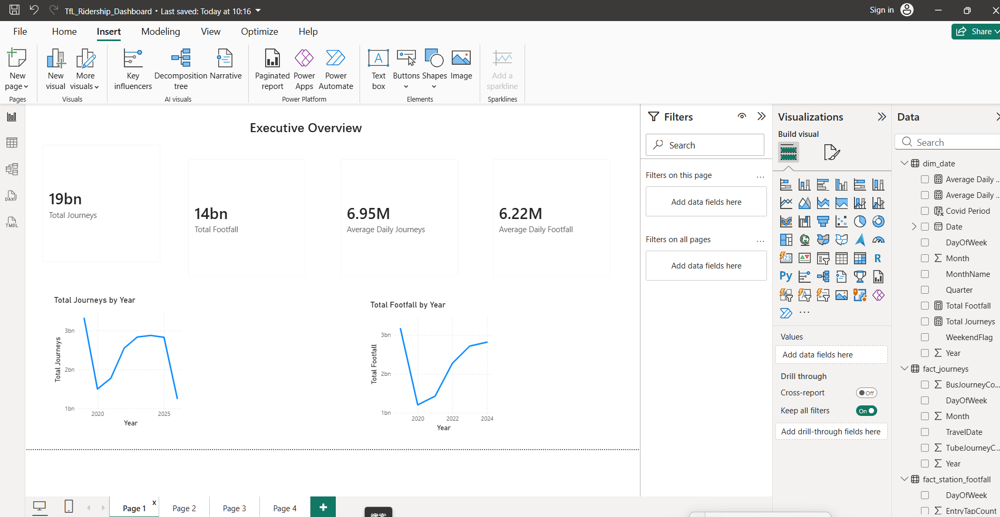
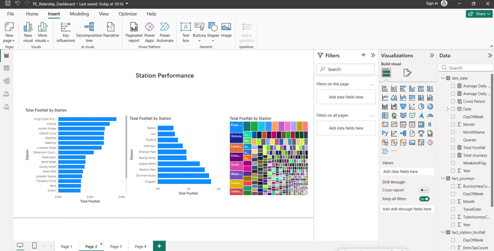
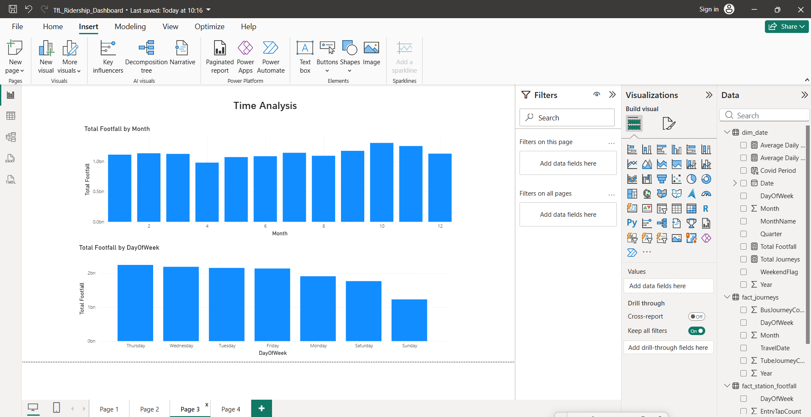
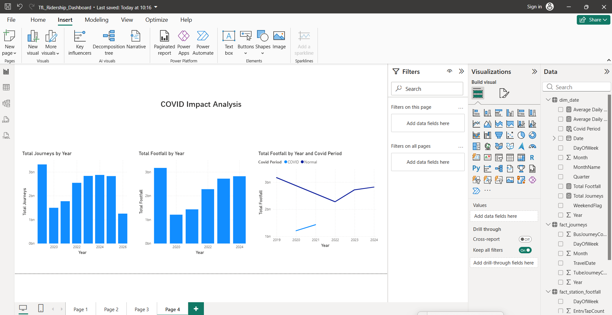

Transport for London (TfL) Ridership & Station Footfall Analysis

Project Overview

This project analyzes passenger journeys and station footfall across the Transport for London (TfL) network between 2019 and 2025.

Using Python and Power BI, the project explores travel demand patterns, station performance, commuter behaviour, and the impact of COVID-19 on London's public transport system.

Tools & Technologies

Python (Pandas)

Power BI,
DAX,

Data Modelling (Star Schema),

CSV Data Processing,

Data Model

A Star Schema was designed to support efficient reporting and analysis.

Fact Tables

    Fact Journeys
    
    Fact Station Footfall

Dimension Tables
    Dim Date
    
    Dim Station

Dashboard Pages

1. Executive Overview

Key business KPIs:

   Total Journeys
   
   Total Footfall
   
   Average Daily Journeys
   
   Average Daily Footfall
   
2. Station Performance

Analysis of station-level demand:

   Top 20 Stations by Footfall
   
   Bottom 20 Stations
   
   Station Share Distribution
   
3. Time Analysis

Passenger behaviour trends:

   Monthly Footfall Trends
   
   Weekday vs Weekend Patterns
   
   Seasonal Demand Analysis
   
4. COVID-19 Impact Analysis

Recovery analysis from 2019 to 2025:

   Demand Decline During COVID-19
   
   Post-Pandemic Recovery Trends
   
   Year-over-Year Performance Comparison
   
Key Findings

Station Performance
King's Cross St Pancras recorded the highest total footfall.

Victoria, London Bridge and Oxford Circus consistently ranked among the busiest stations.

Commuter Behaviour

Weekday demand was significantly higher than weekend demand.

Passenger flows indicate strong commuter-driven travel patterns across the network.

COVID-19 Impact

Total journeys decreased by approximately 55% in 2020.

Ridership recovered steadily between 2021 and 2024, approaching pre-pandemic levels.

Correlation Analysis

Daily journeys and station footfall showed a strong positive correlation (r = 0.984).

Increased network demand was closely associated with higher station usage.

Dashboard Preview

Executive Overview

Station Performance

Time Analysis

COVID-19 Impact Analysis

Business Value

This project demonstrates:

Data Cleaning and Transformation

Dimensional Data Modelling

KPI Development

Power BI Dashboard Design

Time Series Analysis

Transport Demand Analytics

Author

Xu Qingfu

Engineering
